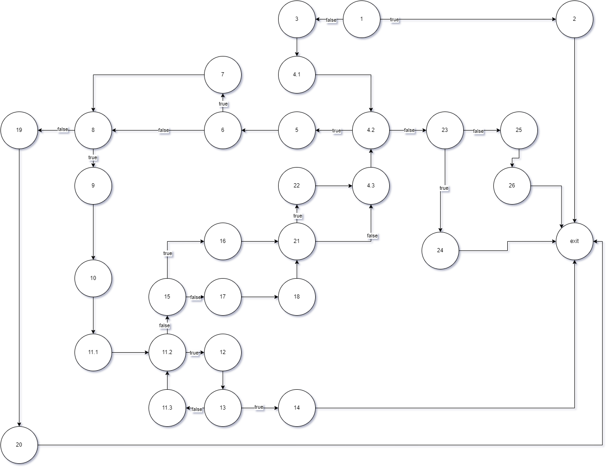

# Втора лабораториска вежба по Софтверско инженерство

## Даниел Пазаркоски, бр. на индекс 213071

###  Control Flow Graph

### Цикломатска комплексност

Цикломатската комплексност на овој код е 10, истата ја добив преку формулата P+1, каде што P е бројот на предикатни јазли. 
Во случајoв P=9, па цикломатската комплексност изнесува 10 (P+1=9+1=10).

### Тест случаи според критериумот „Every branch“

1. allItems==null ~> Во овој тест се испраќа null листа како параметар,што предизвикува програмата да фрли runtime исклучок и да прекине со работа.
2. item.getBarcode()!=null ~> Во овој тест се испраќа листа со повеќе елементи како параметар, а програмата фрла runtime исклучок доколку во листата постои баркод кој е null.
3. allowed.indexOf(c)==-1 ~> Во овој тест се испраќа листа со повеќе елементи, а програмата фрла runtime исклучок доколку баркодот е невалиден.
4. sum<=payment ~> Прави проверка дали сумата на сите производи е помала или еднаква од "payment" и ако е точен условот враќа true.
5. sum>payment ~> Прави проверка дали сумата на сите производи е поголема од "payment" и враќа false ако условот е точен.
....

### Тест случаи според „Multiple Condition“ критериумот
За условот: „if (item.getPrice() > 300 && item.getDiscount() > 0 && item.getBarcode().charAt(0)== '0')“

1. TTT ~> assertTrue доколку сите услови се исполнати.
2. TTF ~> assertTrue доколку цената на сите производи е поголема од 300, има попуст поголем од нула и баркодот не почнува со карактерот "0".
3. TFX ~> assertTrue доколку цената на сите производи е поголема од 300 и нема попуст поголем од нула
4. FXX ~> assertTrue доколку цената на сите производи не е поголема од 300.